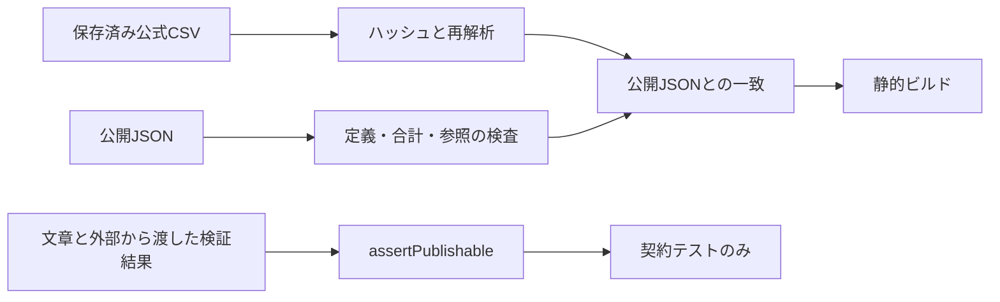
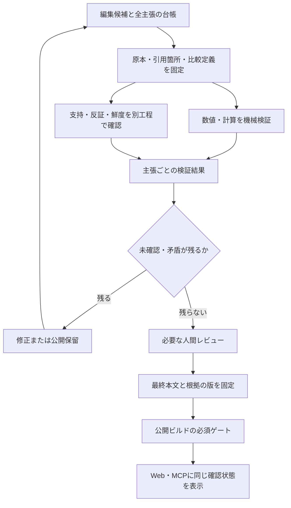

# ファクトチェックの実装状態・使用方法・強化案

確認日: 2026-09-06。対象: Open Yokohama `441826f` のコード。

## 結論

**人口統計の原本照合は実際のビルドで動いています。文章の真偽を調べるファクトチェックは未接続です。**
文章には検証結果を受け取る関数と契約テストがありますが、一次資料を読んで支持・反証を判定する処理、編集画面、専用の実行コマンドはありません。

## 現在の経路



`assertPublishable` の呼び出し元は現在 `tests/review.test.ts` のみです。
`packages/core/issues.ts` の解説や画面の文章を、この関数が公開前に網羅して検証する構成にはなっていません。

## 数値の検証: 実装済み

根拠: [スキーマと整合性検査](../packages/core/schema.ts)、[原本照合](../scripts/validate.ts)、[収集処理](../scripts/ingest.ts)。

| 検査 | 現在の動作 |
|---|---|
| 原本の同一性 | 保存CSVのSHA-256が記録と一致するか確認 |
| 公開値と原本 | 同じCSVを再解析し、公開観測値と一致しなければ停止 |
| 地域と指標 | 横浜市・18区・9指標の欠落、未知の地域、重複を拒否 |
| 数値 | 男女計、市と区の合計、人口密度、世帯当たり人数の整合性を検査 |
| 時点と出典 | 未来の観測、参照できない出典、版の不整合等を拒否 |
| 更新 | 同じ原本は変更せず、新規時点と過去値の変更を区別。過去値変更は候補として止める |

原本と一致することは、原本自体が無謬であることや、数字から導く因果説明が正しいことを意味しません。
照合と抽出には同じパーサーを使うため、両方に共通する解析ミスを再照合だけで必ず検出できるわけでもありません。異常系テストと資料の確認を併用します。
現在の正数・市区合計等の制約は人口データ向けです。出生数等の正当なゼロ、比較統計の非公表値、丸め差は、新しい系列で個別に定義する必要があります。

### 今使えるコマンド

プロジェクトのルートで実行します。

```sh
pnpm data:validate
```

保存済み原本と公開JSONを照合します。外部資料の再取得、文章の検索・真偽判定はしません。
今回の実行結果は「32原本・5,472観測値の一致」です。

```sh
pnpm verify
```

lint・型・単体テスト・原本照合・静的ビルド・公開ページの内部リンク検査を実行します。
文章レビュー関数の契約テストも含みますが、掲載文章そのものをファクトチェックするコマンドではありません。

```sh
pnpm data:refresh
```

公式資料を取得し、候補データを更新します。読み取り専用の確認ではなく、ローカルの原本・取得記録・公開候補を変更する処理です。
運用は[データ更新手順](runbooks/data.md)に従います。この調査では再取得していません。

## 文章レビューの契約: 実装済み・本番経路は未接続

根拠: [review.ts](../packages/core/review.ts)、[契約テスト](../tests/review.test.ts)。

呼び出しは `assertPublishable(article, review, knownCitationIds, actualContentHash)` です。
ファイルやURLを渡せば自動で検証してくれるAPIではありません。呼び出し側が文章・引用台帳・検証結果を準備します。

| 引数・項目 | 現在必要な情報 |
|---|---|
| article | 本文ハッシュと1件以上の主張。各主張にID、fact/analysis/proposal、本文、引用ID |
| review | 同じ本文ハッシュ、確認者名、確認日時、各主張の判定と引用ID・理由、人間承認またはnull |
| knownCitationIds | 呼び出し側が信頼できる引用台帳から作ったIDの集合 |
| actualContentHash | 呼び出し側が対象本文の確定したバイト列から計算したSHA-256 |
| finding.verdict | supported、contradiction、not_found、calculation_errorのいずれか |

現在の関数は、空・欠落・未知ラベル、主張ID重複、検証漏れ、未知の引用、本文ハッシュ不一致を拒否します。
全主張の判定が `supported` でなければ通りません。analysis/proposalがある場合は、同じハッシュへの人間承認も必要です。
呼び出し結果は検査済みのarticle/reviewであり、記事の保存や公開は行いません。

### この関数だけでは保証しないこと

- **本文の真偽**: `supported` と書かれた理由の正しさや、引用本文が主張を支えるかは調べません。
- **主張の網羅**: 入力されたclaimsの全件は確認しますが、実際の画面文章から主張の抜けを検出しません。
- **確認者の本人性・独立性**: reviewer/approverは文字列です。認証、権限、生成者と検証者の分離はありません。
- **本文との結合**: ハッシュの計算自体は呼び出し側の責任です。本文・引用・画面への参照を一体に固定する処理は未接続です。
- **資料の鮮度と引用箇所**: 引用IDの存在は確認しますが、資料の改定、引用位置、期限切れ、支持資料と反証資料の役割までは確認しません。
- **全引用の意味**: findingの引用が主張の引用に含まれるかは確認しますが、付いている全引用を読んだことや意味上の支持は保証しません。

文字列で `supported` と書いた結果を入力できることと、資料を調べて確認済みであることを分けます。
「ファクトチェック済み」の公開表示には、下記の経路を実際に接続する必要があります。

### 契約テストだけを実行する

```sh
pnpm exec tsx --test tests/review.test.ts
```

今回の実行では5件が合格しました。確認したのは、正常系、欠落等の拒否、本文修正での失効、主張・引用IDの不整合、人間承認の条件です。
これは架空の検証入力を使った契約テストであり、実資料を使った文章検証の精度評価ではありません。

## 参考設計から取り入れること

kadai.aiのローカル設計と実装を読み、生成後に別の処理で問題箇所を確認し、修正結果と出典をつなぐ構造を参考にしました。
参考先の稼働環境を今回検証したわけではありません。非公開コード・プロンプト・業務資料は転載していません。

採用したいのは、生成・確認・修正・引用表示の責任分担です。出典URLを表示できることを、主張の支持や最終本文の再検証の代わりにはしません。
Open Yokohamaでは次の経路を先に成立させます。



## 強化の順番と受入条件

| 優先 | 実装単位 | 完了を判断する条件 |
|---|---|---|
| 先行1 | 文章・主張・引用・原本の版を結ぶ台帳 | 公開本文の事実主張が台帳に対応し、未登録の主張や存在しない引用位置でビルドが落ちる |
| 先行2 | 公開経路へのゲート接続 | 選んだ最初の論点ページで、欠落・失敗・未確認の検証結果を与えると実ビルドが止まる |
| 先行3 | 数値・都市比較の検証 | 年度、地域、単位、分母、予算/決算、推計/確定、ゼロ/欠測の混同を検出する |
| 先行4 | 検証記録と修正後の失効 | 生成・確認・承認の主体と版を記録。本文または根拠更新で旧判定が無効になり、再確認まで公開を止める |
| 続行1 | 支持・反証を調べる文章検証 | 実資料に基づく数値誤り、時点違い、因果飛躍、誤引用を見つけ、不明を合格にしない |
| 続行2 | 人間レビューと確認状態の表示 | 必要な承認の本人性・権限を確認し、機械照合・文章検証・人間確認を区別して表示する |
| 続行3 | 回帰評価と更新運用 | 誤りを含む評価資料で見逃しを測定し、正しい主張を誤って止める率も記録。原典改定時に影響する記事を洗い出す |

最初は1ページを対象に、信頼できる手動レビュー結果も受け取れる公開ゲートを通します。その後、検索・AI検証を追加します。
外部AIの実行モデル、費用上限、入力範囲は未決定です。AI自身が付ける自信の数値を、正確さの実測値として表示しません。
本書は仕様・実態の整理であり、ここに挙げた強化機能を実装済みとするものではありません。
