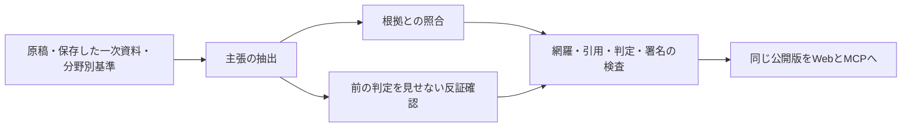

# 文章の根拠検証と公開条件

設計日: 2026-09-06。実行結果・独立レビューは[状態記録](STATUS.md)を参照。

## 対象と仕組み

人口・世帯・人口密度の3記事について、カテゴリー、見出し、要約、問い、限界、未収録事項を対象にします。原稿は `data/editorial/issues.json` に置きます。数値は従来どおり公式CSVと再照合します。画面のすべての文言やサイト全体をAIが検証済み、という意味ではありません。



- 3工程は別セッション。事実を小さな主張へ分割し、全18欄を文字単位で覆う。後続2工程でも意味上の抜けを確認します。
- 引用は保存原文に実在する文字列を要求します。URLや引用IDがあるだけでは通さない。
- `supported`、`refuted`、`insufficient`、`not_applicable` を区別します。根拠不足、反証、判定不一致、未検証部分があれば公開候補を作りません。
- 事実・解釈・提案・非主張と、人間確認が必要かを別々に判定します。政策判断・因果効果・法務財務判断・公式発表・解釈・提案は機械署名だけでは通りません。
- 本文、根拠、分野別基準、検証コードの変更で旧判定を無効にします。署名日時と90日の期限も検査します。根拠の取得から検証まで90日を超える場合も再取得を要求します。
- 署名はEd25519。公開鍵と権限を台帳に置き、機械署名を人間承認へ読み替えることを拒否します。
- 検証中は原稿を修正しません。編集し直したら3工程を再実行します。

## 使い方

通常の確認とビルドにはAI認証も秘密鍵も不要です。原本キャッシュがあればオフラインで検査できます。新しいクローンでは公式HTMLを取得し、記録したハッシュとの一致を要求します。取得不能・原典改定の場合は停止します。

```sh
pnpm data:validate     # 公式CSVと公開数値を照合
pnpm factcheck:check   # 保存原本・署名・公開文章・期限を検査（原本キャッシュがない場合は公式から取得）
pnpm verify           # lint、型、テスト、数値と文章の公開検査、ビルド
```

文章を編集する場合:

1. `data/editorial/issues.json` を編集します。必要な一次資料を取得し、原本と根拠台帳を更新します。
2. `pnpm factcheck:prepare` で送信対象を `artifacts/factcheck/packet.json` に出力し、公開可能な入力だけか確認します。
3. `pnpm factcheck:review` を実行します。Codex CLIの既存認証と既定モデルを使い、抽出・検証・反証を実行します。
4. 不合格なら `artifacts/factcheck/candidate-review.json` の根拠と理由を確認します。判定の手書き変更で通さず、原稿か根拠を修正して再実行します。
5. 合格した原稿・資料・署名・公開JSONを一緒にcommitし、`pnpm verify` と画面・MCPの検証を通す。

最初の署名者の初期化は `pnpm exec tsx scripts/factcheck.ts keygen`。秘密鍵は `.git/factcheck-reviewer.pem` に置き、Git管理しません。既存鍵や承認者台帳を上書きしません。別の端末で鍵を紛失した場合は、台帳の正当な更新と再検証が必要になる。機械鍵を人間鍵として登録し直してはならない。

ビルドでは `review` を自動実行しません。CLIの認証切れ・制限・時間切れ・不正JSONは失敗となり、既存の公開版を上書きしません。各記事の各工程は最大6分です。現在の3記事は工程ごとに並行処理し、合計9回呼び出します。実行時のCLI既定モデル・利用枠に依存し、無料を保証しません。Web閲覧やMCPリクエストではAIを呼びません。

登録済みの根拠は `pnpm factcheck:sources --check` で変更の有無だけを確認できます。`pnpm factcheck:sources` は原本を再取得し、取得日と根拠台帳を更新するため、旧レビューが失効します。公式CSVが改定されていた場合は停止し、人口データの改定手順へ戻します。新しい資料を登録する際は、出典・利用条件・適用範囲を編集者が確認してください。

## 根拠と表示

公式ページはGit管理しない `data/editorial/raw/` のローカルキャッシュ、人口CSVは `data/raw/` に保存し、原本ハッシュと本文抽出・CSV復号結果を照合します。内部機能の説明は現在のスキーマ・問い合わせ・画面コードと一致する根拠で検証します。内部コードを横浜の外部事実の証明には使わない。

記事の「説明文の根拠と確認範囲」から、主張に対応する資料と引用を開ける。MCPの `yokohama://issues/{slug}` は同じ原稿・版・確認状態・検証/反証結果・出典を返します。「AIによる検証」と「人間による確認」を区別します。

## 保証の限界と残る運用

署名は承認記録の改変検出であり、真実の証明でも、モデル実行の第三者証明でもない。署名鍵と台帳を管理する編集者を信頼する設計。別セッションでも同じモデルには共通の誤りがあり、2つの支持判定は独立した確率の証明にならない。

資料の自動Web検索は行いません。承認された原典集合だけを使い、足りなければ止めます。原典の更新検出、資料拡充、分野専門家の基準レビュー、評価事例の増強が必要。特に古い資料を再検証しただけで最新の事実になるわけではありません。

人間の承認経路の本人確認・編集UIは未提供。人間承認が必要な原稿を機械で代行しません。公開済み静的ファイルを期限到来で自動撤回する仕組みはない。期限は次の公開ビルドで検査するため、継続監視・再検証の運用が必要。

`packages/core/review.ts` は旧契約テスト用に残る。実際の公開条件は `packages/factcheck/` と `scripts/factcheck.ts` が担います。構造テストと実資料での意味検証の結果を区別して記録します。

設計根拠は[検証設計と研究](FACT-CHECK-DESIGN.md)を参照。

## グラフの算出解説

人口動態・年齢構成の「このグラフからわかること」は、検査済みの公開数値と同じ配列から定型文を組み立てます。`packages/core/chart-insights.ts` が順位・符号・割合・端点差・自然社会増減の相殺を計算します。因果・政策効果は推定しません。

同率、0、全区マイナス、件数と増減の区別、不詳込みの分母、ポイント差、相殺の3ケースを単体検証し、表示選択との連動とJavaScript無効時の解説をE2Eで確認します。別担当の数式・意味のレビューも行います。既存3記事のAI署名済み検証の対象を、これらの定型文へ拡張したという意味ではありません。

## 地域を読み解く本文

`packages/core/region-story.ts` は、同じ公開値から人口規模比、5年平均、連続する自然減、世代別倍率、年齢不詳を含めた比較を算出します。市・18区の本文と、動態一覧の選択年の本文へ接続します。各系列を最初の年＝100にそろえた人数推移は、SSRと選択後の双方で同じ計算を行います。

本文は観測された構造の変化と、暮らしの議論の問いを区別します。新たな施設不足・政策効果・転居理由は断定しません。5年の連続性、自然減の継続開始、単年と平均の符号、19地域×26時点の出力、年齢不詳を検証します。独立担当は数値・意味・条件分岐をレビューし、対象commitをSTATUSに記録します。既存3記事のAI署名の対象を、この本文へ拡張したとは表示しません。

次の調査先として案内する横浜市2025年人口動態報告（年代・移動先・世帯）と年齢別人口ページは、2026-09-06に掲載内容を閲覧確認しました。将来人口の公表資料も調べましたが、版によって前提が違うため今回の本文には予測値を混ぜていません。
