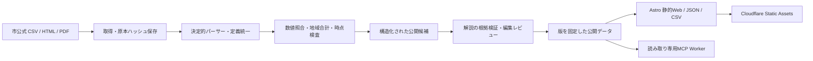

# 横浜市民が継続して使うまでの開発計画

作成: 2026-09-05。依頼: Cloudflareで費用を極小化し、地域密着の公共情報基盤を実装してOSS公開します。
公開基盤の長期構想は[VISION.md](VISION.md)にまとめています。本書は今回の費用・市民向け優先度を反映した実行順です。

## 成果の定義

市民がスマートフォンから、ログインせず自分の区を選び、暮らしの問いを探し、数字の推移と根拠を確認できます。
文章は「まず要点→詳しく→原典」の順にします。同じ事実を全員に提供し、読み方を本人が選びます。
実利用の成功は公開だけでは判定しません。初期利用者10人中8人が「自分の区を探す・他区と比較する・原典を開く」を各2分以内に完了、重大な誤解0件を公開拡大条件とします。
その後、週次利用者100→1,000、再訪率、出典到達率、訂正所要時間を追います。人数・利用実績を開発時に架空で埋めません。

## 構成

公開側はリクエストごとのDB照会・AI生成を行いません。データ更新はバッチ処理し、公開済み版は再現可能にします。
初期正本はGit内のJSONと不変CSV。D1は編集・収集管理の永続サービスが必要になってから、R2は原本がGitの規模を超えてから追加します。

## 開発順と受入条件

| 段階 | 実装・運用 | 受入条件 | 依存 |
|---|---|---|---|
| 0 設計と参照調査 | japan-todo / kadai.ai、費用、編集方針、OSS境界 | 根拠と差分がADRに記録される | なし |
| 1 数字の信頼性 | 出典台帳、原本、厳格なCSVパーサー、版・取得日時、月次人口と18区 | 欠落・重複・合計不一致・形式変更で処理失敗。原本から同じ値を再生成 | 0 |
| 2 市民向け公開β | トップ、課題、18区詳細、比較、検索、出典、訂正案内 | 実データを表示。スマホ・キーボード・主要導線のE2E。アクセス時のAI課金0 | 1 |
| 3 更新とAIの入口 | 再実行可能な更新、差分、公開ゲート、読み取りMCP | 失敗が可視化。未公開候補が公開物に混ざりません。SDKクライアントでMCP実接続 | 1–2 |
| 4 OSS・Cloudflare公開 | MITコード、データ帰属、CI、手順、静的配信 | 秘密0。クリーン環境で再構築。本番URLで導線検証。公開repoでCI成功 | 2–3 |
| 5 内容拡充 | 年齢・出生・死亡・転出入、予算・決算、住宅、防災、子育て、交通 | 指標ごとに定義と更新頻度・原典。政策→予算→成果は対応確認できたものだけ | 3 |
| 6 市民検証 | 18区から多様な読み手を募り、タスク観察と改善 | 上記の利用テスト基準を満たします。読みやすさを年齢・属性推定で自動変更しない | 4–5 |
| 7 運用拡大 | 主要50指標・30課題、都市比較、編集体制、更新監視 | [長期的なv1条件](VISION.md#長期的なv1の到達条件)を実測で満たします。編集待ちの滞留・費用増を監視 | 5–6 |

段階ごとの所要時間はデータ形式とレビュー量に依存します。最初の公開βはこの実装で作り、利用調査・日々の継続更新は時間経過と人間の協力を要します。
段階1–4の完成を長期構想のv1完成や市民利用の達成と呼びません。

## データ・編集の品質

- CSVの数値はLLMに読ませず型付きパーサーで処理。人数は整数、欠測を0にしません。男女計、市と18区計、年月・自治体コードを照合します。
- 前月比の届出数と実際の月間差は別指標。国勢調査に基づく基準改定を人口移動や政策効果と解釈しません。
- 原本はSHA-256で固定し、URLが同じでも変更を新しい版として保存します。原本・正規化・公開物を分離します。
- 解説は事実・解釈・提案・未確認を分離。引用が存在することと主張が真であることを区別します。
- AI検証結果の欠落、空の検証、未知の判定、主張ID不一致は公開不可。修正後の本文ハッシュが変われば再検証します。
- 数値の機械照合は「人間確認済み」と表示しません。政策・因果説明・公式発表は人間承認を必須とします。
- 同じ主張IDを要約と詳細で共有し、読みやすくした際の数字・留保・反証の欠落をテストします。
- 別担当による必要な独立レビューは、担当と対象commitを記録します。未実施を合格としません。

## 費用管理

目標は公開βのサーバー代0米ドル、動的サービス追加後も月5米ドル程度から。上限保証ではなく構成目標。
Cloudflare Static Assetsは静的リクエストと保存の追加料金なし。AI費用・ドメイン・CIは別勘定。
公開ページと検索・比較は静的ファイルで完結。MCPだけ動的Workerで、無料枠超過時も静的Webは動く別デプロイとします。
月次/週次で原典を取得します。無制限クロール・無制限公開チャット・アクセスごとの生成は導入しません。
料金変更、データ容量増、同時利用増に応じて見直します。課金プラン変更・ドメイン購入は具体的な費用を確認して行います。

参照（2026-09-05確認）:
- [Static Assets料金](https://developers.cloudflare.com/workers/static-assets/billing-and-limitations/)
- [Workers料金](https://developers.cloudflare.com/workers/platform/pricing/)
- [D1料金](https://developers.cloudflare.com/d1/platform/pricing/)

## 公開後の改善順

最初の利用テストで「入口を見つけられない」なら分類と検索を改善、「数字の意味が分からない」なら用語と比較基準を改善します。
予算・決算は会計区分・当初/補正・決算年度を一致させます。出生・転入等と人口残高の違いを明示します。
取材・利用者募集・自治体への問い合わせ等の対外連絡は別の明示的な依頼に基づきます。

## 2026-09-06: 公開後の拡充方針

人口・年齢構成・長期時系列・予算決算・暮らしの各領域は、最低限の実装範囲として大枠を共有しました。
加えて東京都・国内都市比較、公共的論点、海外の都市成長・再生事例を扱い、文章ファクトチェックを強化します。

最新の棚卸しと着手順案は[BACKLOG.md](BACKLOG.md)、追加の比較候補と一次資料は[COMPARISONS-AND-ISSUES.md](COMPARISONS-AND-ISSUES.md)に記載しています。
文章検証の公開接続を先行して実装します。対象・操作方法・残る条件は[FACT-CHECK.md](FACT-CHECK.md)、実測結果は[STATUS.md](STATUS.md)に記録します。
これらは開発方針であり、対象の機能・コンテンツを公開済みとするものではありません。

### 根拠・訂正を中心にした進め方

最新の実装順案は[BACKLOGの末尾](BACKLOG.md#根拠訂正を中心とする実装計画最新案)を正本とします。既存ページの根拠参照と訂正経路→人口・国内比較→公共的論点→財政・事業→海外事例と各分野の順で進めます。
出典と根拠の保持は必須とし、内容の幅は維持します。検証した範囲、未確認事項、訂正履歴を読者が確認できる設計にします。記事の訂正可能性は根拠のない断定を公開する理由にはしません。
事実検証と法的な公開判断は別に扱います。専門家の確認が必要な事項を具体化し、未実施の確認を完了と表示しません。万能な検証器を先に完成させる計画から、各コンテンツと根拠・訂正機能を一緒に完成させる計画へ更新します。
