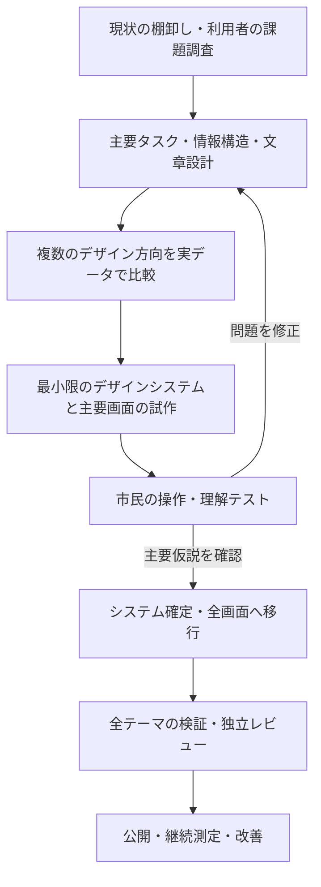

# Open Yokohama リデザイン計画

作成・調査日: 2026-09-06。状態: 調査に基づく計画案。画面実装・公開・市民調査は未実施です。
対象版: `441826ff1a0ab36f6e33741e957c4e6a9f158951`、作業ブランチ: `design`。
全体計画は[PLAN.md](PLAN.md)、公開状態は[STATUS.md](STATUS.md)、既存テーマ仕様は[THEMES.md](THEMES.md)を参照してください。

## 1. 目的と今回の範囲

横浜市民が、自分の区を見つけ、数字の意味を理解し、比較と原典確認まで進めるサイトにします。
そのために、Open Yokohama固有の情報構造、文字組み、図表、テーマの規則を持つデザインシステムを作ります。
今回の成果物は、その調査と実行計画です。以下の工程・数値目標・デザイン案は、特記のない限り本プロジェクトへの提案です。

「Codexのデフォルト」という公式な様式や、他サイトとの一致は今回検証していません。
ユーザーの指摘を起点に、汎用的に見える要因を検証可能な設計課題に置き換えます。
独自性の達成だけでは完成とせず、市民が迷わず読めることと両立させます。

対象は公開βの全画面、共通UI、図表、文章の見せ方、昼夜・期間テーマです。
新しい統計の収集、予算・防災等の提供開始、MCPの機能追加は別計画とします。
未提供の内容を、リデザインの見本を充実させる目的で公開データに見せかけません。

## 2. 調査から採用する進め方

### 一次資料と、このサイトへの適用

| 一次資料 | 調査で確認した考え方 | 本計画での適用 |
|---|---|---|
| [デジタル庁：基本デザイン](https://design.digital.go.jp/dads/foundations/) | サービスのニーズに応じてスタイルを選択・変更します | 操作と読みやすさの基盤を参考にし、横浜固有のスタイルを定義します |
| [デジタル庁：カラー](https://design.digital.go.jp/dads/foundations/color/) | ブランド、機能、意味を持つ色を区別します。フォーカスは黄・黒の二重構造です | ブランド色と警告・リンク・フォーカス・データ系列の役割を分離します |
| [デジタル庁：タイポグラフィ](https://design.digital.go.jp/dads/foundations/typography/) | 書体・サイズ・行高等を用途別に整理します | 日本語本文、数値、単位、注記の役割別スタイルを作ります |
| [デジタル庁：レイアウト](https://design.digital.go.jp/dads/foundations/layout/) | 文書構造と表示環境を踏まえて情報を配置します | 市民のタスクから画面を構成し、スマホと拡大表示で確認します |
| [デジタル庁：利用上の注意事項](https://design.digital.go.jp/dads/introduction/notices/) | 出典・加工の明記など、利用物に応じた条件があります | 採用する文書・コード・素材ごとに出典と利用条件を記録します |
| [GOV.UK：Discovery](https://www.gov.uk/service-manual/agile-delivery/how-the-discovery-phase-works) | 解決策の構築前に利用者の問題と制約を調べます | 現行画面の観察と基準測定を先行します |
| [GOV.UK：Alpha](https://www.gov.uk/service-manual/agile-delivery/how-the-alpha-phase-works) | 不確実性の大きい仮説を試作で検証します | 最初は主要導線を試作し、全画面展開前に理解度を確認します |
| [GOV.UK：コンポーネントの採用基準](https://design-system.service.gov.uk/community/contribution-criteria/) | 有用性、既存との重複、使いやすさ、一貫性、応用可能性を確認します | 実画面で必要な部品から共通化し、使用条件と検証記録を残します |
| [ONS：図表の原則](https://service-manual.ons.gov.uk/data-visualisation/guidance/principles) | 正確で、理解しやすく、シンプルな可視化を重視します | 数値を読む目的から図表を選び、重要な比較を明確にします |
| [ONS：図表の配色](https://service-manual.ons.gov.uk/data-visualisation/colours/using-colours-in-charts) | コントラストと色覚多様性、分類色の一貫性を重視します | 昼夜・期間テーマでも系列の意味と識別性を保ちます |
| [W3C：WCAG 2.2](https://www.w3.org/TR/WCAG22/) | テキスト、操作、拡大、フォーカス等に検証可能な達成基準があります | AAを設計目標とし、自動検査と手動検査を組み合わせます |

参照時のデジタル庁サイト表示はβ版 v2.17.1です。採用時には参照版を固定し、更新による変更を差分で確認します。
デジタル庁のサイト外観の複製や、デザインシステム利用だけを理由としたアクセシビリティ適合の宣言はしません。
WCAG 2.2とJIS X 8341-3:2016を同一の基準として扱いません。

### 推奨フロー

デザインシステムは、画面から切り離して一度に完成させません。
最小限の規則と代表画面を往復して確かめ、全画面移行の前に初版を固めます。

## 3. 現状の棚卸しと検証すべき仮説

今回はソース、既存テスト、案件文書を確認しました。ブラウザでの新たな目視監査は未実施です。
公開URLの調査用取得はエラーだったため、公開サイトの障害とは判定していません。
29の静的HTMLページと過去の検査合格はSTATUSの記録であり、この計画作成時の再検証結果ではありません。

| 確認した実装 | 評価・仮説 | 次工程で確認すること |
|---|---|---|
| トップに大きな明朝見出し、英語小見出し、港の絵、3列の数値と記事カード | 汎用的な紹介ページの構成に見える可能性があります | 初見で何ができるか、自分の区の入口をすぐ発見できるか |
| 「自分の区を見てみる」は比較ページへ遷移し、18区の直接リンクは下部にあります | ボタンの期待と到着先が一致しない可能性があります | 区の選択と比較の入口を分けた案との比較 |
| 多数の注記・ラベルが0.7〜0.88rem、ブランド補足は0.5remです | 統計の条件を読む負担がある可能性があります | 実機、文字拡大、低視力の利用者による確認 |
| `--accent`を操作・ブランドなどで共有し、一部の色・寸法は直接指定しています | テーマ追加時に意味と見た目が結びつきすぎます | フォーカス、状態色、リンク、図表を役割別に整理 |
| `Trend.astro`は最小・最大に合わせた軸、注記、代替説明を持ちます | 誤読を防ぐ良い土台があります | 軸・期間・単位の理解、狭い画面でのラベルの読みやすさ |
| 比較は指標・時点・定義・出典を提供し、増減の棒は絶対値です | 符号と棒の向きの解釈を検証する必要があります | 負値を含む実データで、基準線付きの正負の棒を試作 |
| 検索は端末内で完結し、0件表示・JS無効時の一覧があります | 軽量で利用条件に強い基盤があります | 0件時の次の行動、結果件数の読み上げ |
| 詳しさ切替、原典の行番号、改定の留保があります | 公共情報として維持すべき設計です | 再配置しても重要条件が隠れず、出典へ到達できるか |

主な対象ファイルは `apps/web/src/styles/{global,themes}.css`、`layouts/Layout.astro`、`pages/`、`components/{Harbor,Trend}.astro`、`packages/core/theme.ts`です。

## 4. 市民向けの情報構造と独自性

### 優先するタスク

1. 自分の区を選び、最新の人口・世帯と統計の時点を確認します。
2. 同じ指標・時点で他区と比較し、その差が何を意味するか理解します。
3. 暮らしの問いから解説へ進み、分かることと未確認のことを区別します。
4. 数字から原典、定義、更新・訂正の情報へ進みます。

現段階で調べられるのは人口・世帯等です。「暮らし」という大きな名称でも、現在の収録範囲を入口に明示します。
ナビゲーションの案は「自分の区」「区を比べる」「数字の読み方」「データと出典」「検索」です。
これは確定した名称ではなく、利用者の言葉と経路テストで調整します。既存URLは基本的に維持します。

### デザイン原則の案

| 原則 | 画面での表現 | 判定方法 |
|---|---|---|
| 横浜の生活から入る | 区名と現在提供する内容を入口にし、地域の個性は見出し・罫線・装飾に反映します | 初見の利用者が自分向けの入口を説明できます |
| 数字の条件も一緒に読む | 数値・単位・地域・時点・定義・出典を一組にします | 要約・詳細・印刷で条件が欠けません |
| 公共情報として落ち着いて読める | 本文と操作は読みやすい日本語を使い、装飾と階層を整理します | 小さい文字や低コントラストへの依存がありません |
| 昼夜で表情が変わっても使い方は同じ | テーマで色と装飾を変え、順序・ラベル・操作位置は保ちます | 同じタスクを全テーマで完了できます |
| 市民自身が読み方を選ぶ | 詳しさ切替を維持し、表示設定の追加を試作します | 年齢・属性・所在地の推定で内容を変更しません |

### 比較するデザイン方向

| 方向 | 表現の案 | 主な検証点 |
|---|---|---|
| A：横浜の市民資料室（推奨） | 港の青と白、明確な罫線、読みやすい見出し、索引のような区選択。夜は紺と控えめな灯り | 情報の見つけやすさと横浜らしさを両立できるか |
| B：まちの観測ノート | 数字・年月・短い解説を中心に、記事と図表を連続して読み進める構成 | 親しみやすさを保ちながら、比較や検索の入口を発見できるか |

両案を同じ実データ、同じ主要タスク、スマホ・PC・昼夜で比較します。
ロゴを隠した場合にも、文字・余白・図表・区選択の組み合わせを説明できることを独自性の確認材料にします。
「好きか」だけで選ばず、利用者の理解と操作の結果を優先します。
横浜を港の観光イメージだけで代表させず、内陸部を含む18区の生活を扱える表現にします。
市の公式サイトとの関係は、実際の運営情報に基づいて明示します。

## 5. デザインシステム初版の成果物

### 基本規則

| 分類 | 定義する内容 |
|---|---|
| 文字 | 日本語の本文・見出し・注記・数値・単位。本文16〜18pxを試作開始値とし、重要な条件は本文同等の読みやすさを確保します |
| 余白・配置 | 余白段階、本文幅、見出し間隔、スマホの余白、表の横スクロール。数値は役割に基づくトークンへ集約します |
| 色 | 基本色→役割色→部品の色の対応。ブランド、文字、背景、リンク、状態、フォーカス、図表、装飾を分離します |
| 形・動き | 角丸、罫線、影、アイコン、ホバー、動きの抑制。クリック可能性を位置の移動だけで表しません |
| 文章 | 分かりやすい日本語、時点・単位・出典の表記、未提供・欠測・更新失敗の区別。英語は補助に限ります |
| 図表 | 軸、単位、期間、ゼロ基準の扱い、正負、改定、欠測、凡例、説明、データ表、出典の配置 |

デジタル庁の黄・黒のフォーカス方式を採用する案を基準にし、夜間を含む背景上で確認します。
ブランドや期間テーマの色で、フォーカス・エラー等の意味を上書きしません。
フォント追加は日本語の転送量と端末差を検証してから決定します。既存のシステムフォントを比較基準にします。

### 必要な部品とパターン

- 基本部品：リンク、ボタン、入力、選択、見出し、注記、状態ラベル、開閉、フォーカス。
- 共通ナビゲーション：ヘッダー、パンくず、現在位置、検索、フッター、スキップリンク。
- このサイト固有：区の選択、時点付き数値、推移図、比較表、出典表示、定義、詳しさ切替。
- 状態：未選択・選択中、0件・複数件、初期化待ち、欠測、長文、長い区名、負値、改定、JS無効。
- テンプレート：入口、区詳細、比較、解説、検索、出典・説明、404。

各部品には目的、使う条件・使わない条件、文章例、キーボード操作、状態、全テーマの例、検証記録を付けます。
必要性が一画面に限られる要素は、無理に汎用APIにしません。
コードで描ける既存SVGや罫線を基本とし、装飾画像の制作は方向性が定まってから判断します。

成果物は `docs/design-system/` の仕様と、既存Web内の部品見本を想定します。
トークンと実動作する部品を実装の正本にし、デザイン資料には対応する版を記録します。
初版で専用の外部サービスや別フレームワークを導入する必要はありません。

## 6. 既存テーマの統合

### 必ず維持する契約

| 項目 | 現行の動作と移行条件 |
|---|---|
| 基本 | `yokohama`。通常の青を基準とします |
| 夜景 | `yokohama-night`。横浜の代表座標で日の出・日没を端末内計算します |
| 期間 | `green-expo`。2027-03-19 00:00 JST以上、2027-09-27 00:00 JST未満の設定は保留中です。`enabled: false`を維持します |
| 優先順位 | URLプレビュー→運用設定の手動固定→有効な期間テーマ→昼夜判定→基本色 |
| 更新 | 初回描画前、ページ再表示、タブ復帰、1分ごとの再判定 |
| 保存・通信 | 現行プレビューは保存せず、そのページだけに適用。位置情報・外部API・DBは不要です |
| 付随表示 | favicon、ブラウザのtheme-color、印刷、JS無効時の基本色 |

既存IDを互換の入口として残し、内部では「ブランド」「明暗」「装飾」「意味を持つ色」を分離する案とします。
初版の対象は現在の3テーマです。緑の夜間版など、未実装の組み合わせを自動で増やしません。
期間の開始・終了やテーマ変更によって、人口増減の良否、事実と解釈、注意の意味を変えません。
期間テーマの有効化や公式素材の採用は、リデザインの決定に含めません。

### 試作で判断する追加案

「表示：自動／明るい／暗い」を追加し、夜間でも本人が読みやすい表示を選べる案を試します。
採用する場合は、URLプレビュー→本人の明暗指定→運用上のテーマ解決を基本案とします。
運用テーマと明暗の組み合わせが未対応なら、本人の指定に合う基本の昼夜テーマへ戻します。
保存する場合は端末内のみとし、解除方法・保存不可時の動作を仕様化します。
現在の運用固定との競合、期間テーマへの影響を具体的な画面で確認してから採否を決めます。
OSの明暗設定をどう扱うかもこの段階で決め、横浜の日没判定を無断で置き換えません。

## 7. 段階別の実行計画

所要は小規模チームでの実作業量の仮見積もりです。募集・日程調整・レビュー待ちを含みません。
1人日=約1日の作業量であり、AIの応答時間やカレンダー上の納期を保証する数値ではありません。

| 段階・依存 | 作業 | 成果物 | 完了条件 | 目安 |
|---|---|---|---|---|
| 0：現状把握 | 全URL・状態・テーマを一覧化。主要7テンプレートを撮影。CSS・文章・図表・既存検査を棚卸し。現行の利用観察 | 現状監査、優先課題、比較用の画像・測定値 | 事実と仮説、未確認箇所、対象版を区別できる | 1〜2人日 |
| 1：0の後 | 市民の目的・言葉を整理。入口、区選択、比較、原典到達の流れと文章を低精度で試作 | タスク定義、情報構造、ワイヤー、検証台本 | 未提供機能を約束せず、主要3タスクの経路を説明できる | 2〜3人日 |
| 2：1の後 | A/Bの方向を同じ内容で作成。文字・罫線・図表・昼夜を比較 | スタイル見本、トップ・区詳細・比較の案 | 採用方向と理由、残る仮説を記録できる | 2〜3人日 |
| 3：2の後 | 最小トークン・主要部品を作り、区選択→詳細→比較→原典の試作を接続 | 実動作する縦の導線、部品見本初版、テーマ対応表 | 実データでスマホ・PC・3テーマを検証可能 | 3〜5人日 |
| 4：3の後 | 市民テストとアクセシビリティの初期確認。問題を修正して再確認 | 観察記録、修正一覧、方向性の評価 | 操作と理解の重大な阻害を解決し、初版の規則を確定 | 2〜4人日 |
| 5：4の後 | 残る解説・検索・出典・説明・404・18区全体を移行 | 全画面、システム仕様、運用手順、移行差分 | 既存機能・URL・出典を維持し、全状態を新規則で表示 | 4〜6人日 |
| 6：5の後 | 回帰、自動・手動のアクセシビリティ、性能、独立レビュー、最終市民テスト | 対象版付き検証結果、既知課題、公開候補 | 下記の公開条件を満たす | 2〜3人日 |
| 7：6の後 | 公開、主要導線の実環境確認、比較可能な利用指標の測定 | 公開記録、復旧手順、改善項目 | 公開後も原典・比較・テーマが動作する | 公開作業1人日程度 |

合計の初期目安は17〜27人日です。調査で対象が増えた場合は段階1で見積もりを更新します。
市民検証・独立レビューの日程を確保してから納期を決めます。

AIは棚卸し、仕様、実装、機械検証、修正、再開記録を担当できます。
市民の操作・理解は本人の参加で検証します。独立レビューは実装者以外の担当が行います。
この計画は人への依頼文ではなく、対外連絡や募集は実施していません。

## 8. 市民テストと受入条件

### 調査の設計

- 初期は5〜6人程度の小規模観察を提案します。人数は統計的な代表性を保証しません。
- 年齢だけで区切らず、統計への慣れ、スマホ中心の利用、低いデジタル習熟度、視覚・操作上の支援ニーズを含めます。
- 海沿い・内陸を含む複数区の参加者を想定します。10人で18区全体を代表したとは扱いません。
- 最終確認は既存計画に合わせて市民10人とします。可能な範囲で試作を見ていない参加者を含めます。
- 募集方法、謝礼、個人情報・録画の扱いは実施前に具体化します。外部への募集連絡は別の明示的な依頼を受けて行います。

### タスクと測定

| タスク | 成功の定義 | 記録 |
|---|---|---|
| 自分の区を探す | 指定した区に到達し、人口と時点を正しく答える | 無支援の成否、時間、誤操作 |
| 他区と比較する | 同じ指標と時点で比較し、大小を正しく説明する | 成否、時間、定義への気付き |
| 原典を確認する | 出典から公式原資料に到達し、対象の統計と分かる | 成否、時間、戻れるか |
| 理解を確認する | 推計人口と別概念、増減と政策効果、改定の留保を取り違えない | 回答内容と誤解の理由 |
| 入口・独自性を確認する | 何のサイトか、何ができるか、運営との関係を説明する | 自由回答。好みの評価とは区別 |

既存の「10人中8人が主要タスクを各2分以内、重大な誤解0件」を継承します。
判定を曖昧にしないため、少なくとも8人が3タスクすべてを各2分以内に無支援で完了する運用を提案します。
時間だけでなく、誤答・支援の有無を含めて判定します。
公式運営と誤認する、人口増を政策の成功と断定する、時点の違う数字を同時点として比べる等を重大な誤解の例とします。
新旧比較は同等の難度の課題と順序の入れ替えで学習効果を抑えます。
人数が少ないため、結果を全市民の割合に一般化しません。

### アクセシビリティ・機能・性能

| 領域 | 条件・検証方法 |
|---|---|
| コントラスト | 通常文字4.5:1以上、大きな文字3:1以上、識別に必要なUI・図形3:1以上。全テーマと状態で確認します |
| 操作 | キーボードのみで主要タスク完了。フォーカスが見え、隠れず、順序が自然であることを確認します |
| 操作対象 | 主な単独ボタンは44×44 CSS px以上を設計目標とします。WCAG 2.2 AAの2.5.8は24×24 CSS pxまたは所定の例外であり、区別して記録します |
| 拡大・幅 | 文字200%、320 CSS px相当のリフローを確認。二次元表などの必要な例外は表領域に限定し、ページ全体の横スクロールを避けます |
| 読み上げ | 実際のスクリーンリーダーで区選択、比較変更、検索件数、表、出典を確認します。VoiceOverを基本に、可能ならNVDAも対象にします |
| 特別な表示条件 | 動きを減らす設定、強制配色、印刷、JS無効、遅い初期化、長文・0件・負値を確認します |
| テーマ | 全テーマ×主要7テンプレート×PC/スマホを確認。日時境界・プレビュー・固定・タブ復帰・favicon・印刷は既存契約を回帰検証します |
| データ | 数値・単位・出典ID・原典行・公開JSON/CSVの意味が変わらないことを確認。データ変更をUI変更に混ぜません |
| SEO・経路 | 18区を含む全URL、内部リンク・アンカー、canonical、サイトマップ、404、ブラウザの戻るを確認します |
| 性能 | 段階0で同条件の計測基準を作り、主要画面を同じ端末・回線条件で3回以上測定します。JS/CSS/画像/フォント転送量と描画・操作を比較します |

性能は主要画面の計測中央値が現行比10%以上悪化した場合に原因調査する仮ゲートとします。
これは本計画の回帰検知基準で、標準規格の値ではありません。現行自体が遅ければ維持だけで合格にしません。
具体的な容量予算は段階0の測定後に設定し、実利用データとローカル計測を区別します。
閲覧ごとのAI処理や新たなサーバー処理を導入せず、既存の静的配信・端末内検索を維持します。

実装後は `pnpm verify` と `pnpm test:e2e` を実行し、今回の変更に必要な回帰ケースを追加します。
自動検査だけでWCAG適合や市民の理解を保証しません。過去のE2E合格も新UIの合格として転記しません。

## 9. 移行・公開・保守

1. トークン・基本部品→共通レイアウト→区詳細・比較→トップ→残りの画面の順で移行します。
2. 比較のURLパラメータ、検索、詳しさ切替、データ参照を維持し、見た目への依存があるテストは意味を保って更新します。
3. 移行中の確認はローカルまたは非公開の確認環境で行い、未完の共通CSSを本番へ出しません。
4. 公開候補のcommit、ビルド、検証環境、既知課題を固定します。独立レビューに担当・対象版・結果を記録します。
5. 直前の公開版に戻す手順を[既存の公開手順](runbooks/deploy.md)に追記します。データの版とUIの版を照合します。
6. 公開作業は、その時点の委任範囲と案件規約に従います。公開後に主要3タスク、出典、昼夜表示を確認します。

公開を止める条件は、原典導線の破損、数値の誤表示、主要操作不能、重大な誤解、必要な検証・独立レビューの未実施です。
修正で対象版が変わった場合は、影響する検証をやり直します。

部品の変更は「利用者の問題→変更理由→影響画面・テーマ→検証」の形で記録します。
新しいテーマは既存部品の状態一覧を満たしたものだけを登録します。
参照元の更新はそのまま追従せず、このサイトへの影響を確認します。

公開後はタスク完了、出典到達、検索0件、再訪などを観察する案とします。
計測手段は未決であり、現在取得できている指標とは扱いません。検索語の外部送信を伴う計測は追加しません。
計測導入、謝礼、外部サービスに費用やプライバシー上の追加判断がある場合は、実施前に具体案を示します。
継続確認の実日程は公開日が決まってから予定化します。

## 10. 次に着手する単位と未決事項

次の実行単位は段階0〜2です。画面・状態の棚卸し、現状の撮影と測定、主要導線、2方向のデザイン比較を作ります。
最初のレビュー材料は「トップ・区詳細・比較のスマホ/PC・昼夜の案」と「残す規則・変える規則の一覧」です。

| 未決事項 | 推奨案 | 決める時点 |
|---|---|---|
| 視覚方向 | A：横浜の市民資料室を第一候補に、Bと比較します | 段階2の具体的な画面を見て決定 |
| 本人による明暗選択 | 自動／明るい／暗いを試作し、既存テーマとの優先関係を確認します | 段階3〜4 |
| 市民テストの募集・謝礼 | 小規模観察と最終10人の確認を分けます | 調査実施前 |
| 独立レビューの担当 | UI・アクセシビリティ・統計の誤読を確認できる実装者以外の担当を確保します | 遅くとも全画面移行前 |
| 利用計測 | 既存の取得手段を確認してから、必要最小限の指標を選びます | 公開候補作成前 |

### この計画作成時の確認記録

- 作業開始時のGit差分はありませんでした。既存仕様・テーマ実装・主要画面・検査コードを読んでいます。
- 一次資料を調査し、参照URLと適用箇所を本書に記録しました。
- 画面改修、利用者への連絡、テストの実行、本番への適用は行っていません。
- 市民テスト、性能計測、手動アクセシビリティ検査、独立レビューは今後の工程です。
